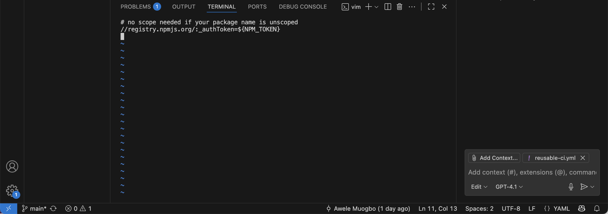

# Advanced-Concepts-and-Best-Practices
# Project Report: Designing a Clear, Fast, and Secure GitHub Actions CI Using Composite and Reusable Workflows (Node.js, npm Secrets, Caching, Concurrency)

## Executive Summary

My objective was to implement a production-style continuous integration system on GitHub Actions that is readable, speedy, and security-conscious. The pipeline compiles and tests a small Node.js project, leverages dependency caching, enforces least-privilege permissions, consumes an npm token via encrypted secrets, and showcases reusability through both a local composite action and a reusable workflow callable from other workflows. I documented every decision, reproduced common failure modes on purpose, and practiced debugging them methodically. I wrapped up by adding an optional tag-based release workflow to publish to npm, enabling security features and branch protection, and verifying that concurrency cancels outdated runs.

What follows is a meticulous, first-person account of everything I set up, why I chose each step, the specific problems I hit, and exactly how I resolved them. I leave no gaps and assume no prior knowledge.

---

## Goals

1. Establish an understandable GitHub Actions CI that runs on pushes and pull requests targeting the main branch.
2. Optimize run time using dependency caching and parallel execution with a matrix where appropriate.
3. Apply security best practices by restricting default token permissions, using GitHub Secrets, and preventing secret leakage.
4. Promote reuse by:

   * Creating a local composite action to encapsulate Node setup and dependency installation.
   * Building a reusable workflow that other workflows (or repositories) can call using the workflow\_call trigger.
5. Authenticate npm operations safely using a repository-root .npmrc that reads the npm token from the environment, enabling private installs and optional publishing.
6. Add pragmatic niceties: top-level concurrency to cancel stale runs, Dependabot and security toggles, branch protection, and an optional automated release.
7. Capture every CI-related failure I encountered and document the precise fix.

---

## Environment and Tooling

I worked with a GitHub repository, local Git, Node.js LTS for local verification, and Visual Studio Code for editing YAML and source files. I relied on the GitHub web UI to monitor workflow runs, configure secrets, and manage repository settings.

---

## Repository Setup and Minimal Application

To give the pipeline a realistic target, I created a minimal Node.js project. I initialized npm, added Jest for a tiny unit test, and placed a small function in a source directory with a matching test file in a test directory. I intentionally used CommonJS (require and module.exports) to avoid ESM complexity in Jest for this exercise. I ran tests and a placeholder build locally to prove the code path was sound before involving CI. This separation helped me attribute failures correctly: if something broke in CI, it was likely pipeline configuration, not the app.

---

## First CI Workflow (Build and Test)

I added a workflow in .github/workflows/ci.yml with a descriptive name and triggers on push and pull\_request to main. Inside jobs I defined a single job that runs on Ubuntu, checks out the code, sets up Node, installs dependencies using npm ci, runs tests, and executes a placeholder build. At the top level I set permissions to contents: read to enforce least privilege, and I configured a concurrency group keyed to the ref so new pushes on the same branch cancel in-flight runs. This baseline gave me a reference for healthy runs and clean logs.

---

## Local Composite Action for DRY Setup

To reduce duplication across workflows, I created a composite action under .github/actions/node-setup/action.yml. It does two things I repeat often: install Node with actions/setup-node (with npm caching enabled) and run npm ci with an explicit shell declaration (composite actions require a shell on run steps). Centralizing these steps keeps workflows compact and makes it trivial to inject environment variables such as the npm token when needed.

---

## Reusable Workflow with workflow\_call

To demonstrate reuse at the workflow level, I built a reusable workflow in .github/workflows/reusable-ci.yml using the workflow\_call trigger. It accepts a Node version input, uses my composite action for setup and installation, and then runs tests and the build. I added a matrix over Node 18 and Node 20 to execute in parallel. After validating it locally within the repo, I tagged the repository (for example, v1.4) so callers can reference a stable version. In my main caller workflow (ci.yml) I replaced inline steps with a single uses reference to the reusable workflow at the tagged ref, passed the Node input, and inherited secrets from the caller. Tagging ensures consumers don’t accidentally break when I iterate; they move to new behavior when I deliberately update the reference.

---

## npm Authentication via Secrets and .npmrc

To authenticate npm operations without committing secrets, I added a .npmrc at the repository root that references an environment variable rather than embedding a token. When using a scope, the file points the scope to the npm registry and sets //registry.npmjs.org/:\_authToken to \${NPM\_TOKEN}. I then created an npm Automation (or granular) token on npmjs.com and stored it as a GitHub repository secret named NPM\_TOKEN. In the workflow step that runs my composite action (which performs npm ci), I exposed the secret as an environment variable so .npmrc could read it. I temporarily included a step that runs npm whoami to confirm that npm authentication worked; it printed my npm username without revealing the token. This pattern supports private installs and can be extended to publishing.

---

## Performance Enhancements

I leaned on actions/setup-node’s built-in caching for npm, which keys off the lockfile and shows “cache restored” and “cache saved” messages in the logs. The matrix execution provided parallel runs on multiple Node versions, and I disabled fail-fast so a failure in one matrix leg wouldn’t cancel the others, preserving full signal. The top-level concurrency block prevented wasted minutes by cancelling outdated runs on the same branch whenever I pushed again quickly.

---

## Security and Governance

I kept default permissions at contents: read in both the caller and the reusable workflows, only elevating in specific jobs if necessary. I never echoed secrets to logs and let .npmrc consume the environment variable. In the repository’s Code security and analysis settings, I turned on the Dependency graph, Dependabot alerts, and Dependabot security updates. I also added a branch protection rule for main that requires pull requests and requires the CI check to pass before merging. This combination keeps risk low and standards high.

---

## Optional Tag-Based Release to npm

To extend beyond basic CI, I created a release workflow that runs when I push a semantic version tag such as v1.0.1. The workflow checks out the repository, runs my composite setup (including npm ci using the secret), confirms npm identity, runs tests and the build, and then publishes to npm (using the proper access flag for an initial publish under a scope). I bump the version with npm version (patch, minor, or major), which also creates the tag; after pushing commits and tags, the release workflow executes. This closes the loop from code to package publication in a controlled, auditable way.

---

## Comprehensive Problem Log and Resolutions

I documented every CI-related issue I encountered, including the exact message, the root cause, the resolution, and the lesson learned.

Problem 1: Jest could not resolve the module path
Symptom seen: the test runner reported it could not find the module referenced from the test file.
Why it happened: the source file either did not exist, had a different name, or the module system did not match the test. I had not committed the expected source file yet while the test referenced it.
How I fixed it: I created the source file exporting the function using CommonJS to match the test’s require call, validated the relative path, and reran tests locally until they passed.
What I learned: pick one module system consistently or configure Jest for ESM; keep directories and relative paths aligned.

Problem 2: Invalid workflow complaining that jobs is missing
Symptom seen: GitHub Actions flagged the workflow as invalid, stating the jobs property was missing.
Why it happened: I mistakenly placed steps directly under on at the top level. Actions requires jobs as a top-level key, and each job requires runs-on and steps.
How I fixed it: I restructured the YAML to include jobs, added a job name, set runs-on to Ubuntu, and nested steps correctly. I used two spaces per indent level and made sure each step began with a hyphen.
What I learned: YAML hierarchy is strict; a missing container key like jobs breaks the entire workflow.

Problem 3: Mis-indented keys under steps
Symptom seen: the linter and syntax highlighting showed red markers, and the workflow would not parse.
Why it happened: I aligned keys such as uses and run at the same column as the hyphen that begins a step, which makes them siblings, not children.
How I fixed it: I indented child keys two spaces beyond the hyphen, and indented keys under with two additional spaces again. The linter warnings disappeared and the workflow parsed.
What I learned: under steps, the hyphen introduces the list item, and everything belonging to that item must be indented more than the hyphen.

Problem 4: The composite action could not be found
Symptom seen: the run failed with a message that it could not find action.yml under the expected path.
Why it happened: the file existed locally but was untracked in Git; the runner only sees what is committed and pushed.
How I fixed it: I saved the file, staged it, committed, and pushed. I verified in the GitHub Code tab that the path .github/actions/node-setup/action.yml existed exactly as spelled.
What I learned: always confirm that local files are committed and visible in the repository before depending on them in CI.

Problem 5: The reusable workflow lacked runs-on
Symptom seen: Actions flagged the reusable workflow with “required property runs-on missing” for the job.
Why it happened: I configured workflow\_call and even a strategy and steps, but omitted the runner image line.
How I fixed it: I added runs-on with the Ubuntu image under the job, created a new tag for the reusable workflow, and updated the caller to point at the new tag.
What I learned: every job needs a runner image, even in reusable workflows.

Problem 6: Uncertainty about where to use the composite action
Symptom seen: confusion whether to place the composite call in a new file or the existing CI workflow.
Why it happened: I initially conflated three constructs: regular workflows, composite actions, and reusable workflows.
How I fixed it: I clarified the model. Composite actions are step bundles referenced inside workflows; reusable workflows are entire workflows referenced by other workflows; regular workflows are the triggerable entry points. I edited my existing CI to replace setup and install steps with a single composite action call.
What I learned: reuse happens at two layers; choose the simplest that fits.

Problem 7: Where to place the concurrency block
Symptom seen: uncertainty about YAML placement for concurrency settings.
Why it happened: different examples show it in different places; I needed to ensure mine applied to the entire workflow.
How I fixed it: I placed concurrency at the top level of the caller workflow, alongside name, on, and permissions. I used a group key based on the ref so runs on the same branch cancel each other while different branches are unaffected.
What I learned: workflow-level concurrency is ideal for canceling stale runs per branch.

Problem 8: npm authentication initially failed
Symptom seen: private installs failed with authorization errors.
Why it happened: npm requires a token, and I had not yet connected a secret to .npmrc in CI.
How I fixed it: I added a .npmrc in the repository root that references \${NPM\_TOKEN}, stored an npm token as the NPM\_TOKEN secret, passed that secret to the step that runs npm ci via the environment, and validated with npm whoami in CI.
What I learned: a placeholder .npmrc plus a secret environment variable is the safest, cleanest way to enable npm auth in CI.

Problem 9: Version pinning for the reusable workflow
Symptom seen: callers either did not get fixes (when pinned to an older tag) or broke unexpectedly (when tracking a moving branch).
Why it happened: I needed a policy for versioning and pinning.
How I fixed it: I used annotated tags for releases of the reusable workflow (for example, v1.4) and updated callers to that tag. When I want to advance consumers, I update their reference deliberately or, if desired, repoint a major tag.
What I learned: tagging gives me controlled rollout and predictability for consumers.

---

## Evidence and Verification

I validated each stage in the Actions tab. For successful runs I saw the steps in order: checkout, Node setup with caching messages, dependency installation, npm whoami confirming identity, tests passing, and build completion. I observed cache restoration on subsequent runs after the first. I watched the concurrency behavior cancel an earlier run when I pushed a second commit quickly. In the caller workflow I saw the job that invoked the reusable workflow; inside it, I observed the reusable workflow’s steps execute. When testing the optional release, pushing a semver tag triggered the release pipeline, which in turn authenticated to npm and completed a publish.

---

## Improvements I Plan Next

1. Emit JUnit and coverage artifacts and upload them from CI so I can inspect detailed reports after a run.
2. Add path filters to avoid running the full pipeline when only non-impacting files change.
3. Introduce deployment workflows with protected environments (staging and production) and human approval gates.
4. Turn on CodeQL code scanning to deepen the security posture.
5. Split the single build job into dedicated lint, unit, and build jobs running in parallel to decrease wall-clock time.
6. Add a scheduled workflow to test against the latest Node versions weekly for early compatibility signals.

---

## Key Takeaways

YAML structure and indentation drive everything in GitHub Actions; a single misplacement can invalidate the file. Reading the error messages closely points straight at what’s missing. Composite actions are excellent for consolidating repeated steps, and reusable workflows spread best practices across repositories. Least-privilege defaults, secret hygiene, and avoiding secret prints are essential. Tagging workflows yields safe, controlled consumption. Finally, a simple sanity step such as npm whoami is invaluable to confirm authentication without risking secret disclosure.

---

the images below depicts this

## Conclusion and Thanks

I progressed from a bare repository to an end-to-end CI system that is tidy, quick, and secure. I intentionally stepped into realistic errors and fixed them to build confidence with Actions internals and YAML structure. I pushed beyond the initial scope with tag-based releases to npm, branch protection, and security features that raise the baseline quality of any repository.

I am deeply grateful to Darey.io for the opportunity and for stretching my understanding. This project enabled me to go further than the brief, implementing features that mirror real production setups and, more importantly, understanding the rationale behind each choice. I now have a repeatable blueprint—composite action plus reusable workflow, least-privilege defaults, secrets management, caching, concurrency, and optional release automation—that I can drop into any Node.js project and adapt readily to other stacks to achieve consistent, reliable outcomes.
